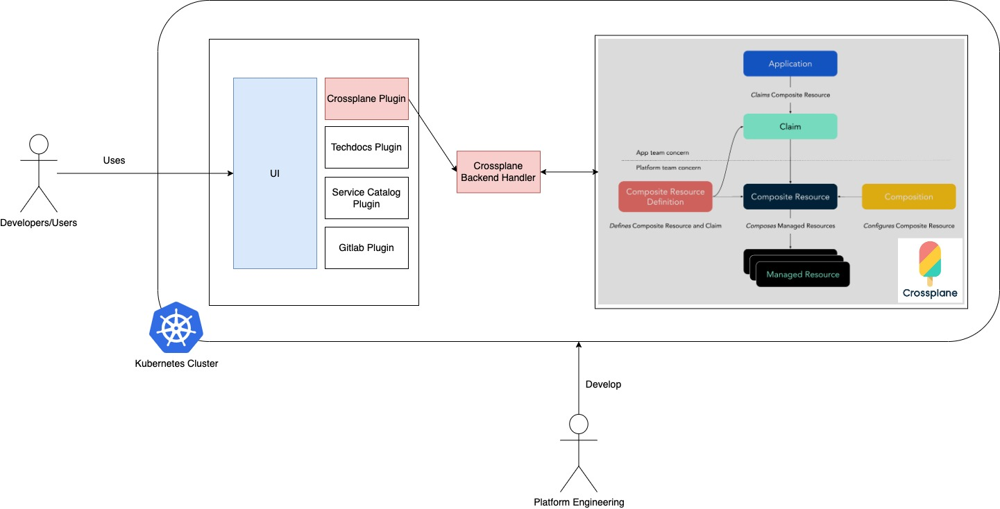

# Overview
This project sets up a framework for creating an Internal Developer Platform (IDP), an internal application designed for developers.

The goal of this project is to provide a faster and more effective way to create an IDP using the Backstage.io framework, with Crossplane as the core backend.

# Folder Structure
```
├── application                      # This is where IDP developed with backstage.io
│   ├── backend
│   └── frontend
├── custom-provider                  # This is custom provider developemnt for crossplane
│   └── gitlab
├── docs                             # Storing all documentation related
├── helm                             # Helm chart for installing all required resources for this platform framework
│   └── crossplane-components
│       ├── charts
├── imgs                             # All images
├── README.md                        # Main readme document
└── Taskfile.yaml                    # Taskfile script for automation (works like Makefile)
```

# Architecture


# Reference
## Backstage.io
[Backstage.io](https://backstage.io/) is an open platform for building developer portals. It was created by Spotify and is now a CNCF (Cloud Native Computing Foundation) project. Backstage aims to streamline and standardize the way developers interact with infrastructure, services, and tools.

### Key Features

- **Service Catalog**: Centralized service management with metadata and ownership information.
- **Software Templates**: Standardized templates for creating new services and components.
- **TechDocs**: Documentation as code, integrated directly into the developer portal.
- **Plugins**: Extensible with a wide range of plugins to integrate with various tools and services.

### Benefits

- **Improved Developer Productivity**: Simplifies access to tools and services, reducing cognitive load.
- **Standardization**: Enforces best practices and consistency across the organization.
- **Extensibility**: Easily customizable and extendable to fit specific organizational needs.

### Getting Started

To get started with Backstage, you can follow the [official documentation](https://backstage.io/docs).

### Example

Here's a simple example of how to create a new Backstage app:

```sh
npx @backstage/create-app
```

For more detailed instructions, visit the [Backstage documentation](https://backstage.io/docs/getting-started/).


```

This summary provides an overview of Backstage.io, its key features, benefits, and a quick start guide.
```

## Crossplane
[Crossplane](https://crossplane.io/) is an open-source project that enables you to manage your cloud infrastructure and services using Kubernetes-style declarative APIs. It extends Kubernetes to manage resources from multiple cloud providers and on-premises environments.

### Key Features

- **Multi-Cloud Management**: Manage resources across different cloud providers using a single control plane.
- **Kubernetes Native**: Leverage Kubernetes APIs and tooling to manage infrastructure.
- **Extensibility**: Easily extend Crossplane with custom resource definitions (CRDs) and controllers.
- **Composability**: Create reusable infrastructure compositions to standardize and simplify resource management.

### Benefits

- **Unified Control Plane**: Centralize management of cloud resources across multiple providers.
- **Declarative Configuration**: Use Kubernetes manifests to define and manage infrastructure.
- **Scalability**: Scale infrastructure management with Kubernetes' robust ecosystem and tooling.
- **Community and Ecosystem**: Benefit from a growing community and a rich ecosystem of providers and add-ons.

### Getting Started

To get started with Crossplane, you can follow the [official documentation](https://crossplane.io/docs).

### Example

Here's a simple example of how to install Crossplane using Helm:

```sh
helm repo add crossplane-stable https://charts.crossplane.io/stable
helm install crossplane --namespace crossplane-system crossplane-stable/crossplane
```

For more detailed instructions, visit the [Crossplane documentation](https://crossplane.io/docs/getting-started/).


```
This summary provides an overview of Crossplane, its key features, benefits, and a quick start guide.
```
